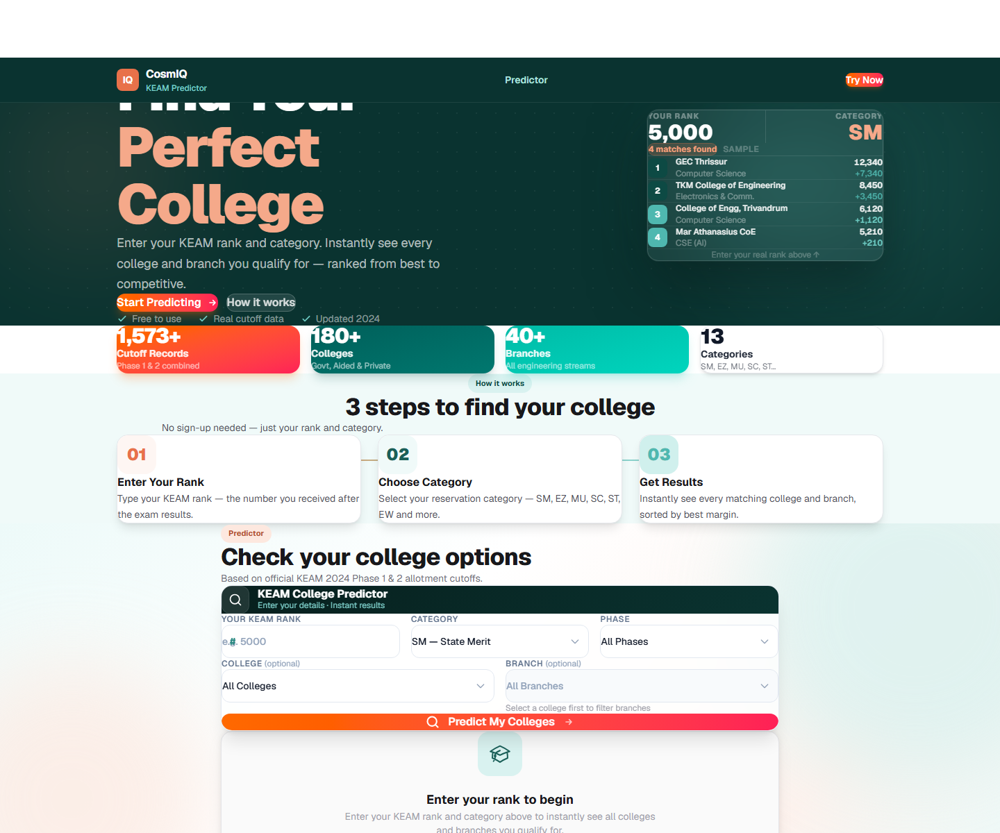

# CosmIQ KEAM Predictor

**Find which Kerala engineering colleges and branches your KEAM rank can get you, based on previous years' allotment cutoffs.**

🔗 **Live:** [cosmiq-keam-predictor.vercel.app](https://cosmiq-keam-predictor.vercel.app)



---

## Features

- Rank + category search across historical closing ranks, with searchable college/branch filters
- Results as a grid or table
- **Admin upload** — bulk-import new cutoff data from the browser; server-side API routes use the Supabase service role, so it never reaches the client

## Tech stack

Next.js 16 (App Router) · React 19 · TypeScript · Tailwind CSS · Supabase (Postgres)

## Run locally

```bash
npm install
# .env.local: NEXT_PUBLIC_SUPABASE_URL, NEXT_PUBLIC_SUPABASE_ANON_KEY, SUPABASE_SERVICE_ROLE_KEY
npm run dev
```

Schema: [`supabase/migrations`](./supabase/migrations). Seed data: `scripts/upload-data.mjs`.

> The same predictor engine powers the official [Pragathi KEAM Help Desk portal](https://github.com/muhammedrinshidvpr-coder/pragathi-keam-portal).

## Author

Built by [Muhammed Rinshid V P](https://github.com/muhammedrinshidvpr-coder) · [CosmIQ](https://github.com/muhammedrinshidvpr-coder)

## License

[MIT](./LICENSE)
